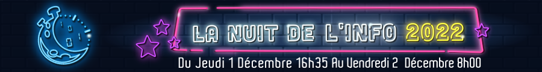
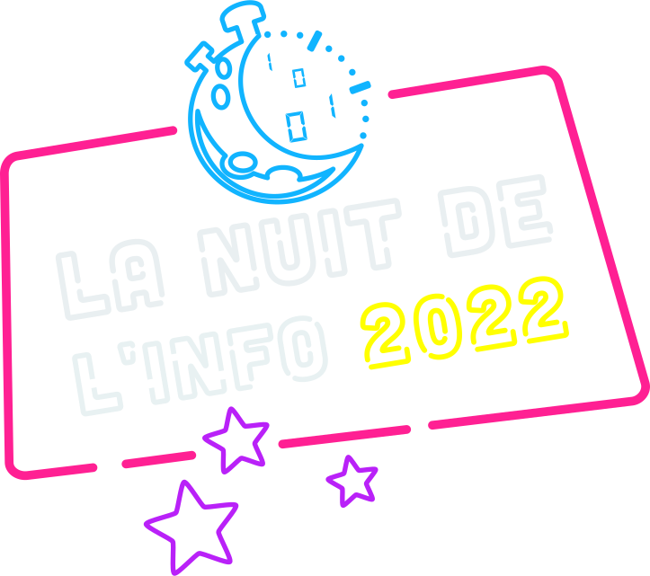

# [ French version](./README.fr.md)


Ce dépôt contient notre solution pour la tâche de la Nuit de l'Info 2022.
Le serveur est ecrit en Java avec le framework [sparkjava](http://sparkjava.com/) et [Maven](https://maven.apache.org/).
Le client est ecrit en JavaScript avec le framework [Vue.js](https://vuejs.org/).

## Contributeurs :

| [](https://github.com/Sigmanificient)  | Interface utilisateur / Frontend |
|-----------------------------------------------------------------------------------------------------------------------------------------------|:---------------------------------|
| [](https://github.com/coco33920)       | Backend                          |
| [](https://github.com/jaggernaute)     | Backend                          |

## :arrow_up: Dépendances

- [Java 11](https://www.oracle.com/java/technologies/javase/javase-jdk8-downloads.html)
- [Maven 4.0.0](https://maven.apache.org/download.cgi)
- [npm](https://www.npmjs.com/get-npm)

## ☄️ Installation

Utilisez la commande suivante pour installer et lancer le projet sur votre machine:

```sh
make run
```

<center></center>
