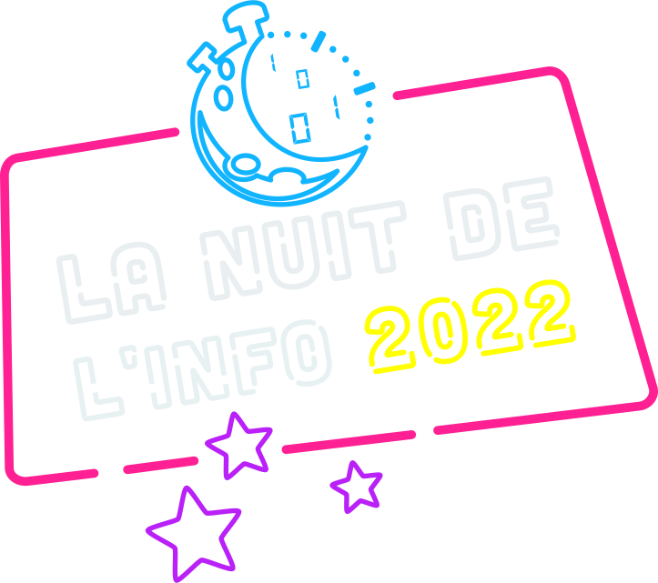

# [ French version](./README.fr.md)


This repository includes our solution to the task of the Nuit de l'Info
competition 2022.
The server is written in Java using [sparkjava](http://sparkjava.com/) and [Maven](https://maven.apache.org/).
The client is written in JavaScript using [Vue.js](https://vuejs.org/).

## Contributors :

| [](https://github.com/Sigmanificient)  | UI designer / Frontend |
|-----------------------------------------------------------------------------------------------------------------------------------------------|:-----------------------|
| [](https://github.com/coco33920)       | Backend                |
| [](https://github.com/jaggernaute)     | Backend                |

## :arrow_up: Dependencies

- [Java 8](https://www.oracle.com/java/technologies/javase/javase-jdk8-downloads.html)
- [Maven 4.0.0](https://maven.apache.org/download.cgi)
- [npm](https://www.npmjs.com/get-npm)

## ☄️ Installation

Use the following command to install and start the project on your machine:

```sh
make run
```

<center></center>
